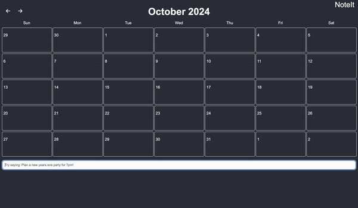

# CS290 Project

**Names:** Zach Benedetti, Garrett Fratzke, Jack Fraley

**Email address:** benedetz@oregonstate.edu, fratzkeg@oregonstate.edu, fraleyj@oregonstate.edu

**Purpose of the application:** The purpose of NoteIt is to allow users to create a calendar that will have to-do’s and events to add. You can also add miscellaneous things like journal entries to a day. This app will also include a login page, so the user can create an account, then log in.

**Data:** Login information, to-do’s, events, journal entries, other notes

**Work Distribution:**

Garrett Fratzke: HTML and help with JS if needed

Zach Benedetti: CSS and help with JS if needed

Jack Fraley: JS
